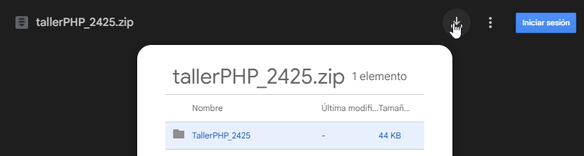
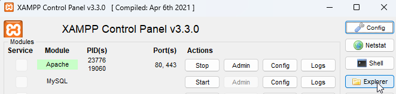
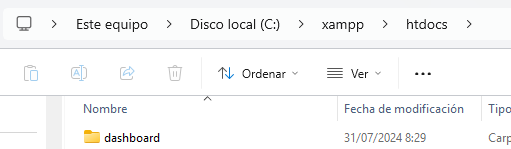
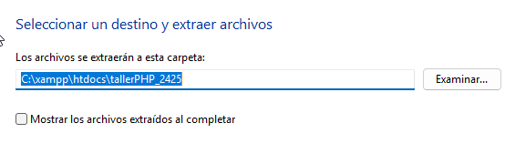
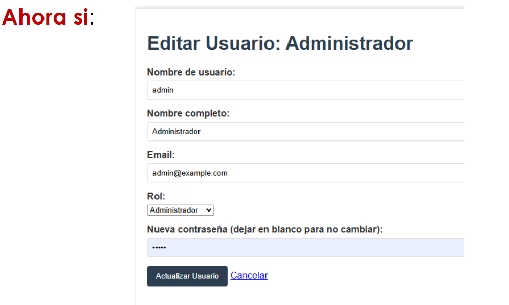
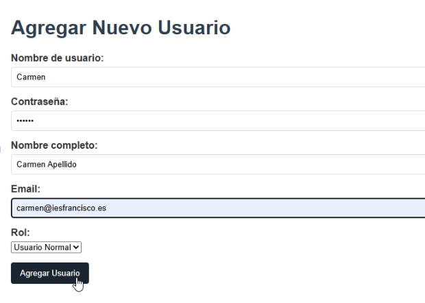
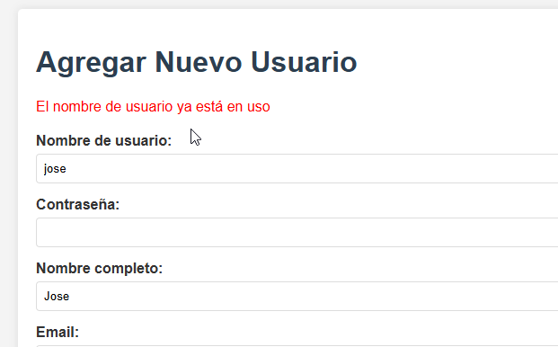
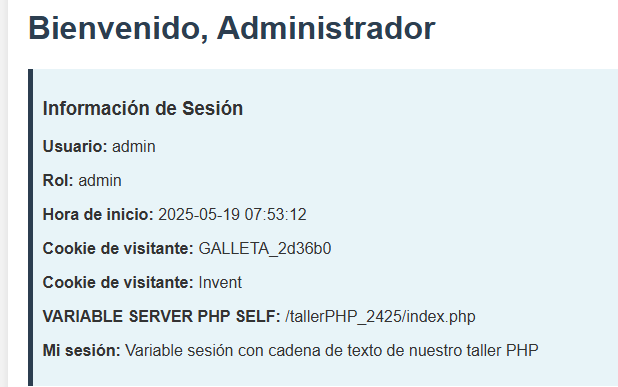
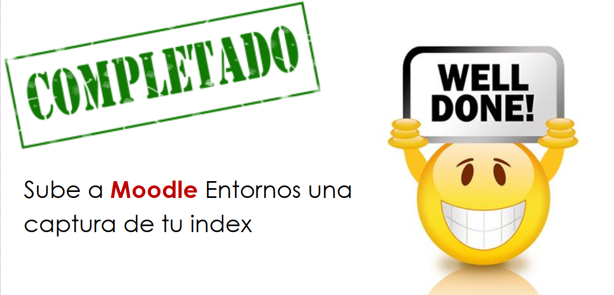

# Taller PHP

[DÍA DE INTERNET Enlace](https://www.diadeinternet.org/2025/?)

# Instrucciones

## Reto 1 Preparar

* Descarga los archivos ([enlace descarga](https://drive.google.com/file/d/1NKEyBh2ROHjg_Uj2IQ8xIRNIRs7zaCKh/view?usp=sharing))
* Ubícalos descomprimidos en **XAMPP**/**HTDOCS (C:\xampp\htdocs)**

IMPORTANTE! Extraer en HTDOCS

## Reto 2 Editar

Fichero **index.php**

??? success "Código corregido"

    `<a href="actualizar_usuario.php?id=<?php echo $usuario['id']; ?>">`**Editar** `</a>`

## Reto 3 Add user

Fichero **agregar_usuario.php**

??? success "Código corregido"

    `VALUES (:username, :password, :nombre, :email, :rol)');`

## Reto 4 Redirigir

Fichero **agregar_usuario**.php

??? success "Código"

    `header('Location: index.php'); `

## Reto 5

Fichero **agregar_usuario.php**

??? success "Código corregido"

    `if ($result->fetchArray())`

## Reto 6

Fichero **login.php**

??? success "Código corregido"

    `$cookie_value = "GALLETA_" . bin2hex(random_bytes(3));`

Debes salir y entrar de nuevo, si no se cambia.. ya veremos por qué.

## Reto 7

Fichero **login.php (arriba)**

??? success "Código que necesitas"

    `setcookie("galleta_inventada", "Invent"); `

Fichero **index.php (línea 60 aprox)**

??? success "Código que necesitas"

    `
<strong>Cookie de visitante:</strong> <?php echo $_COOKIE['galleta_inventada'] ?? 'No disponible'; ?>
 `

## Reto 8

Fichero **index.php**

??? success "Código que necesitas"

    `
<strong>VARIABLE SERVER PHP SELF:</strong> <?php echo $_SERVER['PHP_SELF']; ?>
 `

## Reto 9

Fichero **index.php**

??? success "Código que necesitas"

    ` 
<strong>Mi sesión:</strong> <?php echo htmlspecialchars($_SESSION['taller']); ?>
`

Pero anters de lo anterior, necesitarás definir esa variable de sesión en el fichero **login.php**

??? success "Código que necesitas"

    `$_SESSION['taller'] = 'Variable sesión con cadena de texto de nuestro taller PHP'; `

## Reto 10

Fichero **logout.php**

??? success "Código corregido"

    Sólo necesitas descomentar algunos bloques de código (igual que Java /* */)

Buen trabajo!

