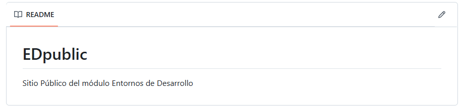
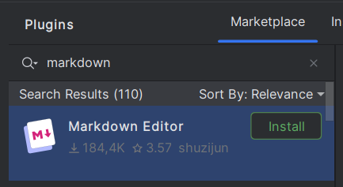
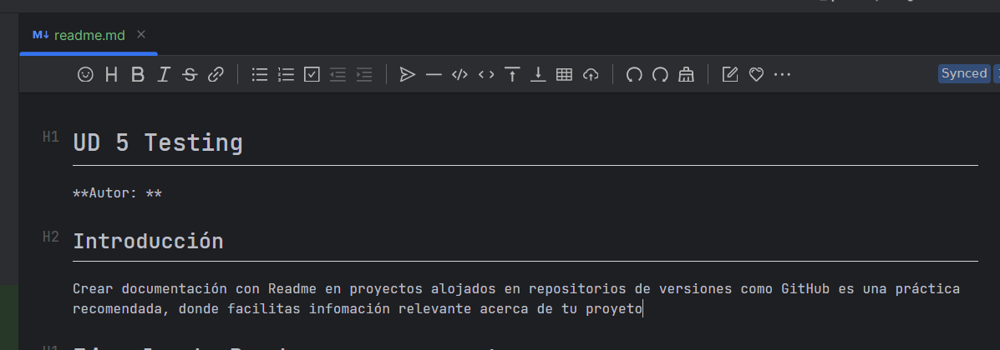
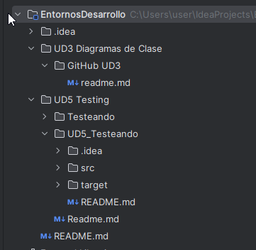
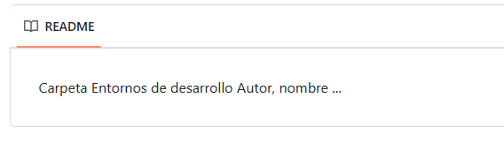
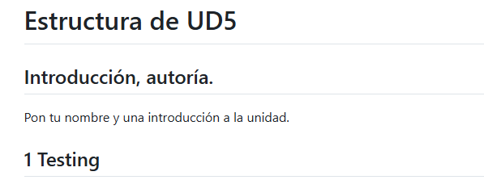
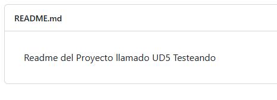
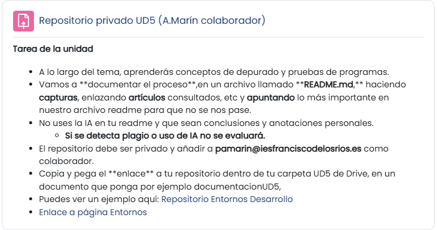

## ¿Qué es Markdown?

Markdown es un lenguaje de marcado ligero que te permite escribir texto con formato (títulos, listas, enlaces, imágenes, etc.) de forma sencilla. Es ideal para documentar proyectos y se usa comúnmente en plataformas como **GitHub** o GitLab.

Ejemplo sencillo:



## Documetación

¿Cómo documentamos el README.md?

En nuestro proceso de testeo, vamos a crear archivos README dentro del proyecto con la documentación del proceso, capturas, enlaces utilizados, etc.

Podemos ayudarnos de un plugin llamado MARKDOWN EDITOR





## ¿Qué es un archivo readme, y para qué sirve?

El cual nos va a facilitar hacer la documentación en Markdown más fácilmente y establecer títulos, subtítulos, enlaces, negrita, apartados, código, etc.

Los archivos  *readme* , a menudo creados como *readme.txt* o  *readme.md* , suelen contener **información importante** sobre el sistema, proyecto o *software* al que se refieren. Para que los usuarios puedan encontrar fácilmente el archivo de un vistazo, se recomienda ubicarlo en el nivel superior del directorio.

[(Enlace artículo IONOS)](https://www.ionos.es/digitalguide/paginas-web/desarrollo-web/archivo-readme/#:~:text=Los%20archivos%20readme%2C%20a%20menudo,el%20nivel%20superior%20del%20directorio.)

---

## 📦 Requisitos previos: Plugin de Markdown

La mayoría de las versiones modernas de **IntelliJ IDEA** ya traen el plugin de Markdown instalado. Pero por si acaso, aquí te muestro cómo verificarlo o instalarlo:

### 🔧 Verificar o instalar el plugin de Markdown

1. Ve a **File > Settings** (o **IntelliJ IDEA > Preferences** en macOS).
2. Navega a  **Plugins** .
3. Busca `Markdown` en el marketplace.
4. Si no está instalado, haz clic en **Install** y luego  **Restart IDE** .

---

## 📝 Paso 1: Crear un archivo Markdown

Con el plugin activo, puedes crear un archivo `.md` así:

1. Haz clic derecho sobre el directorio raíz del proyecto (o en una carpeta como `docs/`).
2. Elige  **New > Markdown File** .
3. Ponle un nombre, por ejemplo: `README.md` o `guia-usuario.md`.
4. IntelliJ abrirá el archivo con soporte para vista previa y resaltado de sintaxis Markdown.

---

## ✍️ Paso 2: Escribir tu documentación

Aquí tienes un ejemplo completo de cómo comenzar:

```markdown
# Proyecto Java: Gestor de Tareas

Este es un proyecto Java que permite gestionar tareas desde consola. Incluye funcionalidades como agregar, eliminar y listar tareas.

## 🛠️ Tecnologías usadas

- Java 17
- IntelliJ IDEA
- Maven

## 📁 Estructura del proyecto

```

src/
└── main/
└── java/
└── com/
└── ejemplo/
├── Main.java
└── gestor/
├── Tarea.java
└── GestorTareas.java

```

## ▶️ Cómo ejecutar el proyecto

```bash
git clone https://github.com/usuario/proyecto-java.git
cd proyecto-java

mvn compile
mvn exec:java -Dexec.mainClass="com.ejemplo.Main"
```

## 🔗 Enlaces útiles

* [Documentación de Java](https://docs.oracle.com/en/java/)
* [Repositorio del proyecto](https://github.com/usuario/proyecto-java)

## 🖼️ Imágenes del proyecto

Puedes agregar una imagen así:

```markdown

```

> 📌 *Asegúrate de que la imagen esté dentro del proyecto, por ejemplo en la carpeta `docs/`, y usa la ruta relativa correcta.*

## 👤 Créditos

Creado por Juan Pérez.

```

---

## 👁️ Vista previa del Markdown

Para ver el archivo como si estuvieras en GitHub:

1. Abre el `.md` en IntelliJ.
2. Haz clic en el botón **"Preview"** o usa el atajo `Ctrl + Shift + A` y busca "Toggle Preview".

---

¿Te gustaría que prepare una plantilla editable basada en tu proyecto actual? Puedo ayudarte a generarla automáticamente con solo decirme el nombre del proyecto y qué secciones quieres que tenga.
```

## HAZLO TU: Estructura para documentar esta unidad

Copia y pega en tu README los puntos de esta unidad.

Después, actualiza tu Carpeta UD5_Testing para verla.

* Introducción, autoría.

1. Testing
2. Pruebas
3. Debug
4. Framework
5. CI/CD
6. Calidad
7. Referencias

```markdown
# Estructura de UD5

## Introducción, autoría.

Pon tu nombre y una introducción a la unidad.

## 1 Testing

## 2 Pruebas

## 3 Debug

## 4 Framework

## 5 CI/CD

## 6 Calidad

## 7 Referencias


```

### Estructura Readmes Repositorio y UD5:

Así, tendremos:

1. un Readme para el REPOSITORIO
2. Otro principal en la carpeta  UD5,
3. y podremos obtener un readme por cada proyecto (aunque en principio sólo creemos un Proyecto Java)



Si te fijas, tendremos **Tres readmes** como comentaba anteriormente, aunque pueden ser más y se vería así:







### Actualiza tu repositorio periódicamente.

Sube el enlace a la tarea Moodle (**[enlace](https://educacionadistancia.juntadeandalucia.es/centros/cordoba/mod/assign/view.php?id=348671)**):

* Privado y con colaborador pamarin@iesfranciscodelosrios.es



Ten siempre tu repositorio actualizado con los últimos cambios y referéncialo con enlaces en la carpeta UD5 de Google Drive.


