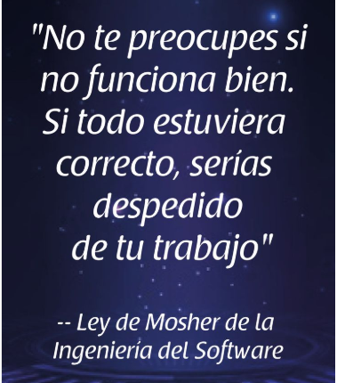
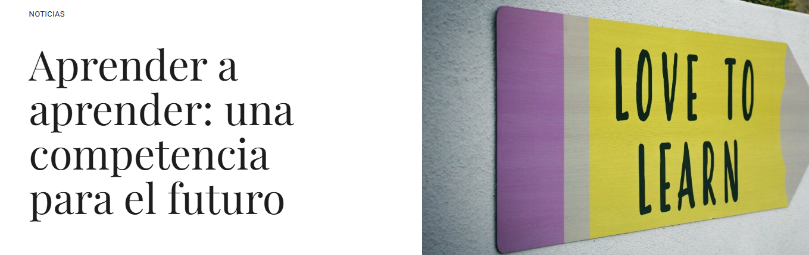
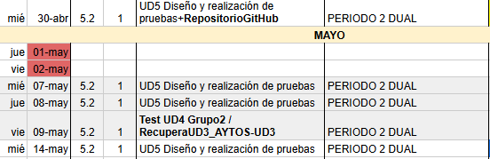
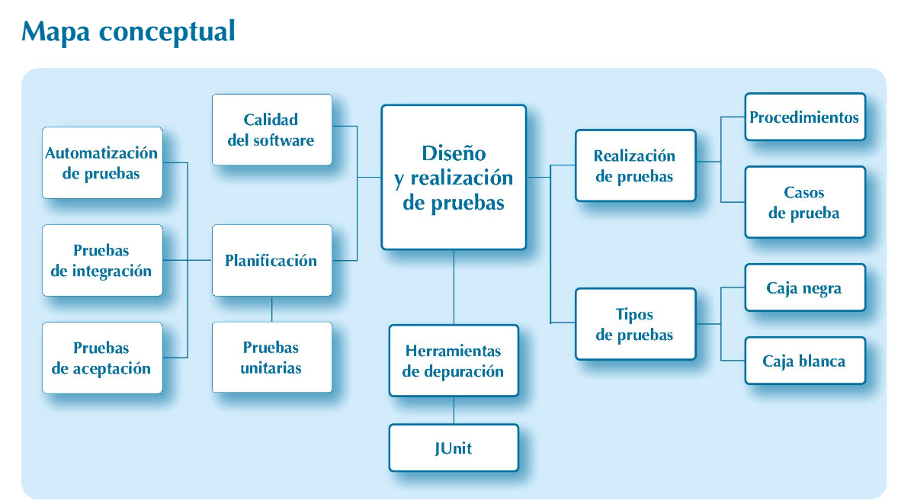
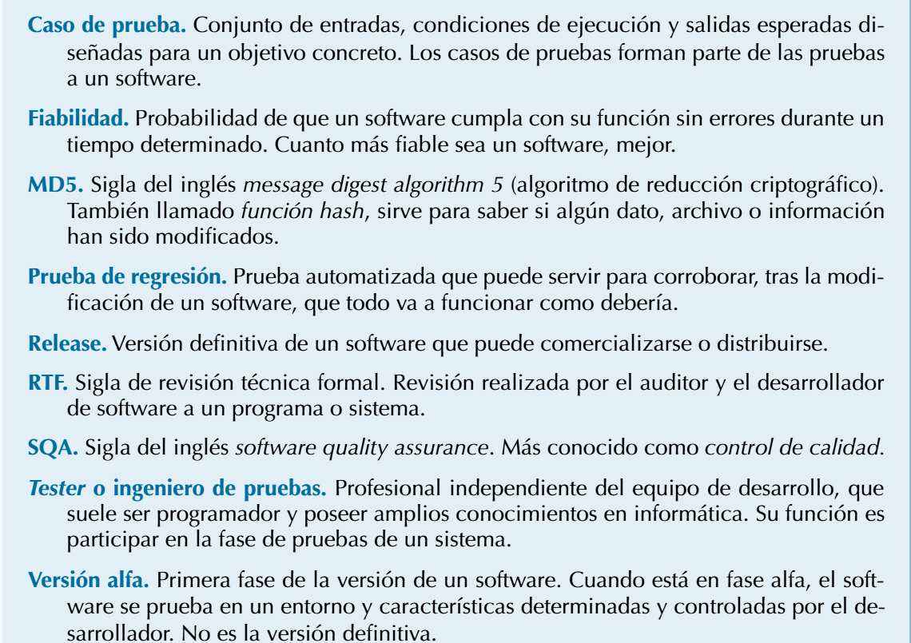

# UD5 Testing

## Introducción

## Offtopic: "Aprender a aprender"

> En el siglo XXI, la evolución de la tecnología condiciona los estándares sociales a los que los individuos deben hacer frente. Como consecuencia de ello, es necesario generar cambios en los cimientos de la educación, desarrollando en el alumnado competencias, como  **aprender a aprender** , para que sigan aprendiendo de forma autónoma a lo largo de toda la vida

* **Enlace a artículo ([enlace](https://www.hablamosdeeducacion.es/actualidad/aprender-a-aprender-competencia-educacion-futuro))**

## Índice

## Temporalización

4-5 sesiones de una hora.

Grupo 1 Dual

Grupo 2 Dual

## ¿Qué es?

## ¿Son importantes las pruebas?

## Mapa Conceptual

## Glosario

# Objetivo/tarea de la unidad

* A lo largo del tema, aprenderás conceptos de depurado y pruebas de programas.
* Vamos a **documentar el proceso**,en un archivo llamado **README.md,** haciendo capturas, enlazando artículos consultados, etc y apuntando lo más importante en nuestro archivo readme para que no se nos pase.
* No uses la IA en tu readme y que sean conclusiones y anotaciones personales.
  * **Si se detecta plagio o uso de IA no se evaluará.**
* El repositorio debe ser privado y añadir a *pamarin@iesfranciscodelosrios.es* como colaborador.
* Copia y pega el **enlace** a tu repositorio dentro de tu carpeta UD5 de Drive, en un documento que ponga por ejemplo documentacionUD5,
* Sube el **enlace con la documentación** a tu repositorio también  a Moodle

Puedes buscar en internet [ejemplos de documentación como este.](https://github.com/djaque/project-task)

## Enlaces

- Diapositivas Testing
- Teoría de Moodle [(enlace)](https://educacionadistancia.juntadeandalucia.es/centros/cordoba/pluginfile.php/203718/mod_resource/content/17/ut5.html#6.1.-qa-y-qc)
- [Enlace ](https://sites.google.com/iesfranciscodelosrios.es/dam1-entornos-desarrollo/inicio)a Web Google con diapositivas.
