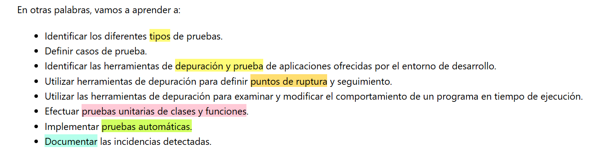
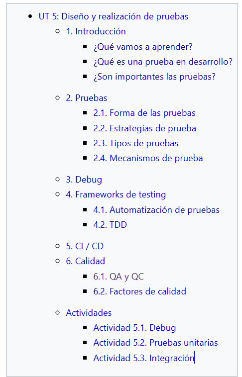
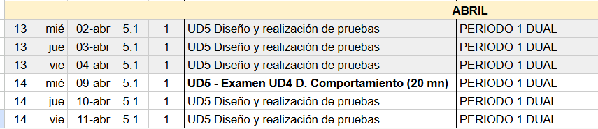
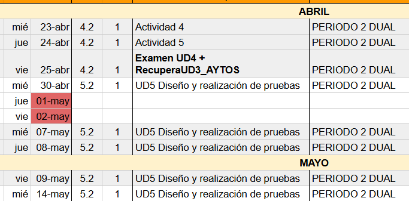
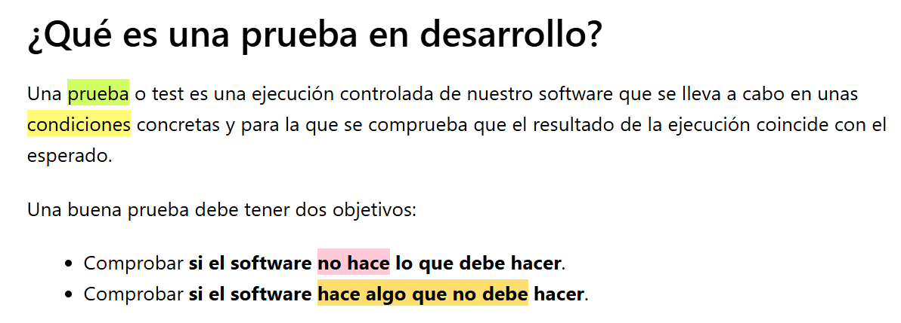
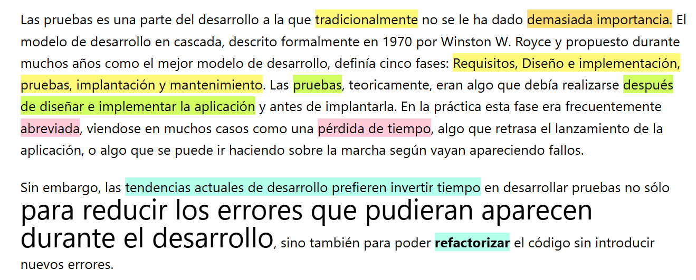

# UD5 Testing

## Introducción

## Índice

## Temporalización

5-6 sesiones de una hora.

Grupo 1 Dual

Grupo 2 Dual

Grupo completo:

## ¿Qué es?

## ¿Son importantes las pruebas?

## Enlaces

- Diapositivas Testing
- Teoría de Moodle [(enlace)](https://educacionadistancia.juntadeandalucia.es/centros/cordoba/pluginfile.php/203718/mod_resource/content/17/ut5.html#6.1.-qa-y-qc)
- [Enlace ](https://sites.google.com/iesfranciscodelosrios.es/dam1-entornos-desarrollo/inicio)a Web Google con diapositivas.
