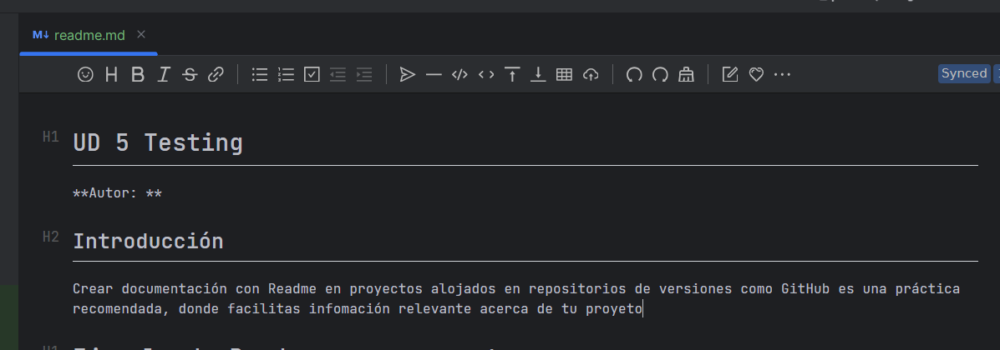

# UD5 Testing


## Introducción


## Offtopic: "Aprender a aprender"

> En el siglo XXI, la evolución de la tecnología condiciona los estándares sociales a los que los individuos deben hacer frente. Como consecuencia de ello, es necesario generar cambios en los cimientos de la educación, desarrollando en el alumnado competencias, como  **aprender a aprender** , para que sigan aprendiendo de forma autónoma a lo largo de toda la vida


* **Enlace a artículo ([enlace](https://www.hablamosdeeducacion.es/actualidad/aprender-a-aprender-competencia-educacion-futuro))**


## Índice


## Temporalización

5-6 sesiones de una hora.

Grupo 1 Dual


Grupo 2 Dual


Grupo completo:

## ¿Qué es?


## ¿Son importantes las pruebas?


## Documetación

¿Cómo documentamos el README.md?

En nuestro proceso de testeo, vamos a crear archivos README dentro del proyecto con la documentación del proceso, capturas, enlaces utilizados, etc.

Podemos ayudarnos de un plugin llamado MARKDOWN EDITOR




## ¿Qué es un archivo readme, y para qué sirve?

El cual nos va a facilitar hacer la documentación en Markdown más fácilmente y establecer títulos, subtítulos, enlaces, negrita, apartados, código, etc.

Los archivos  *readme* , a menudo creados como *readme.txt* o  *readme.md* , suelen contener **información importante** sobre el sistema, proyecto o *software* al que se refieren. Para que los usuarios puedan encontrar fácilmente el archivo de un vistazo, se recomienda ubicarlo en el nivel superior del directorio.

[(Enlace artículo IONOS)](https://www.ionos.es/digitalguide/paginas-web/desarrollo-web/archivo-readme/#:~:text=Los%20archivos%20readme%2C%20a%20menudo,el%20nivel%20superior%20del%20directorio.)

## Código básico para un proyecto:

Puedes estructurar un proyecto básico con la siguiente estructura, en nuestro caso  vamos a documentar el aprendizaje de la unidad5 Testing

```markdown
# Ejemplo de Readme.md para proyecto:

**Proyecto Java: Gestor de Tareas**

## Descripción

Este proyecto es una aplicación sencilla de consola escrita en Java que permite gestionar tareas. Los usuarios pueden agregar, listar y marcar tareas como completadas.

## Características

* Agregar nuevas tareas
* Listar tareas pendientes
* Marcar tareas como completadas
* Guardado de tareas en un archivo de texto

## Requisitos

* Java 11 o superior
* IDE como IntelliJ IDEA, Eclipse o VS Code
* (Opcional) Maven o Gradle para gestionar dependencias

## Instalación y Ejecución

1. **Clonar el repositorio**
   ```bash
   git clone https://github.com/usuario/gestor-tareas-java.git
   cd gestor-tareas-java
```

2. **Compilar el proyecto**
   ```bash
   javac src/com/proyecto/Main.java -d bin
   ```
3. **Ejecutar la aplicación**
   ```bash
   java -cp bin com.proyecto.Main
   ```

## Tecnologías

* Java SE
* Manejo de archivos con `File` y `BufferedReader/Writer`
* Uso de `ArrayList` para gestionar las tareas

## Ejemplo de Uso

```
Bienvenido al Gestor de Tareas
1. Agregar tarea
2. Listar tareas
3. Marcar como completada
4. Salir
Selecciona una opción: 1
Introduce el nombre de la tarea: "Estudiar UML"
Tarea agregada con éxito.
```

## Licencia

Este proyecto está bajo la licencia [CC-BY-SA.

```

```

## Mapa Conceptual


## Glosario


# Objetivo/tarea de la unidad

* A lo largo del tema, aprenderás conceptos de depurado y pruebas de programas.
* Vamos a **documentar el proceso**,en un archivo llamado **README.md,** haciendo capturas, enlazando artículos consultados, etc y apuntando lo más importante en nuestro archivo readme para que no se nos pase.
* No uses la IA en tu readme y que sean conclusiones y anotaciones personales.
  * **Si se detecta plagio o uso de IA no se evaluará.**
* El repositorio debe ser privado y añadir a *pamarin@iesfranciscodelosrios.es* como colaborador.
* Copia y pega el **enlace** a tu repositorio dentro de tu carpeta UD5 de Drive, en un documento que ponga por ejemplo documentacionUD5,
* Sube el **enlace con la documentación** a tu repositorio también  a Moodle
* Puedes ver un ejemplo aquí: [Repositorio Entornos Desarrollo](https://github.com/pamariniesfranciscodelosrios/EntornosDesarrollo/tree/main/dam/ed)

## Estructura para documentar est unidad

Copia y pega en tu README los puntos de esta unidad:

* Introducción, autoría.

1. Testing
2. Pruebas
3. Debug
4. Framework
5. CI/CD
6. Calidad
7. Referencias

Puedes buscar en internet [ejemplos de documentación como este.](https://github.com/djaque/project-task)

## Enlaces

- Diapositivas Testing
- Teoría de Moodle [(enlace)](https://educacionadistancia.juntadeandalucia.es/centros/cordoba/pluginfile.php/203718/mod_resource/content/17/ut5.html#6.1.-qa-y-qc)
- [Enlace ](https://sites.google.com/iesfranciscodelosrios.es/dam1-entornos-desarrollo/inicio)a Web Google con diapositivas.
