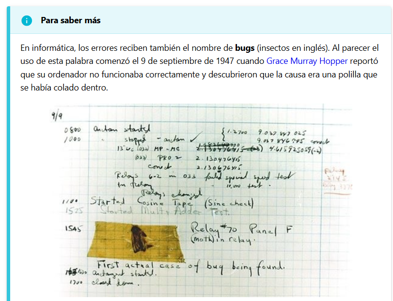
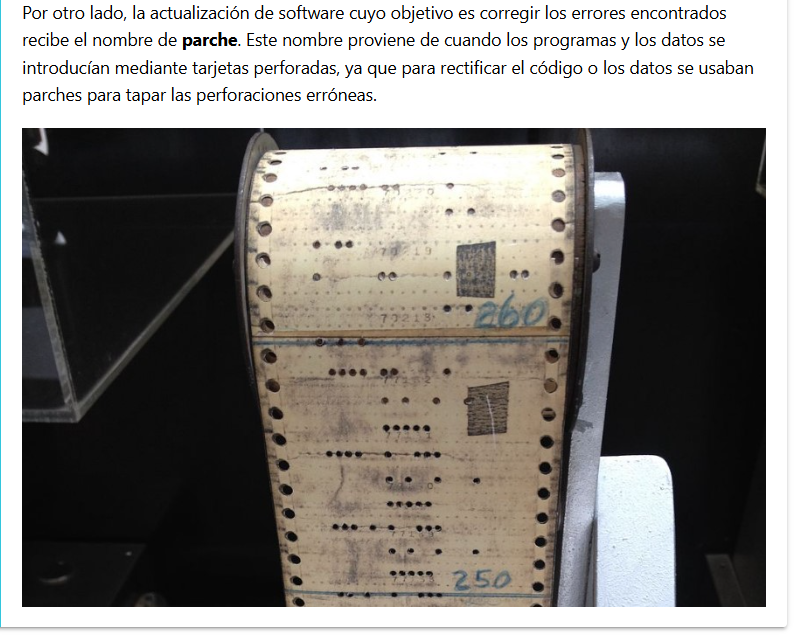
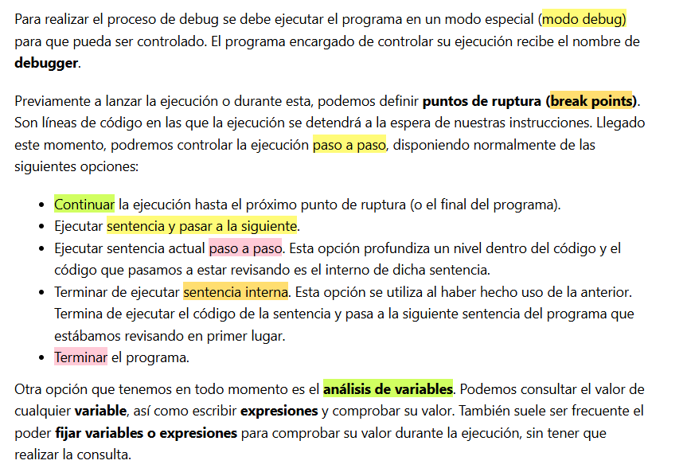
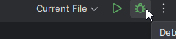
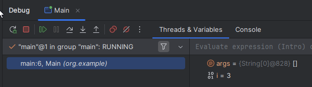

## 3 Debug

El proceso de *debugging* o depuración consiste en **ejecutar el código de forma controlada** con la intención de identificar y determinar la causa de errores o  *bugs* .

## Captura de prueba para debugging

 
