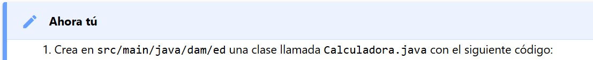
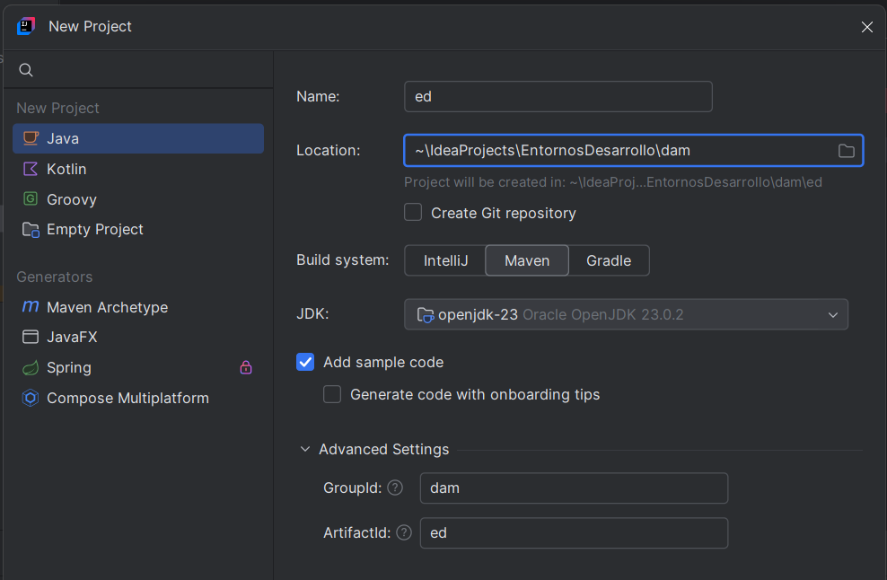
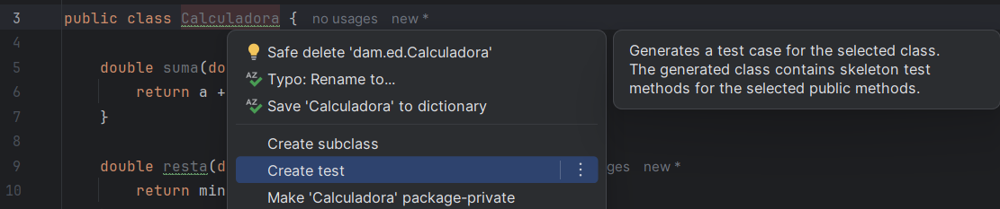
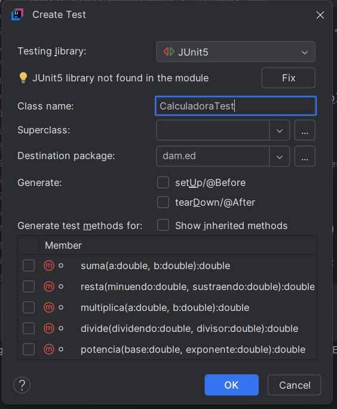
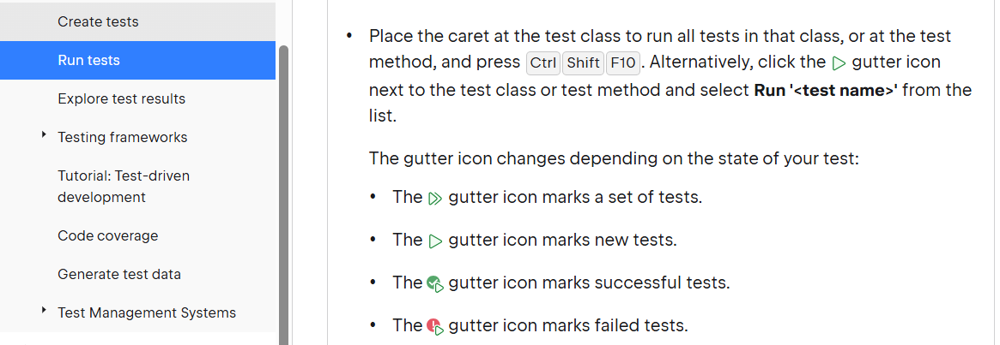
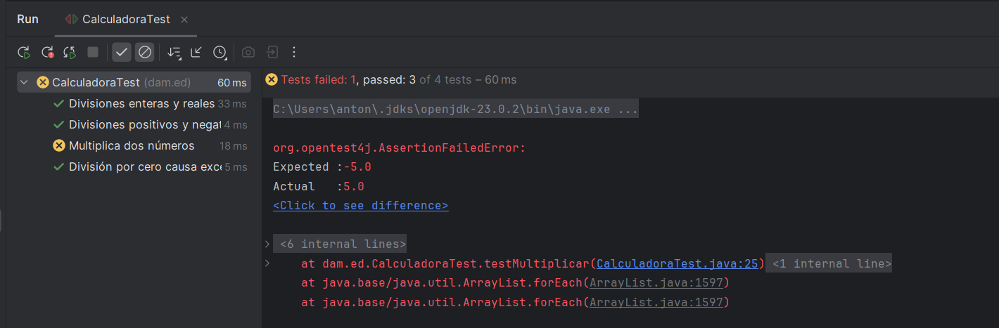
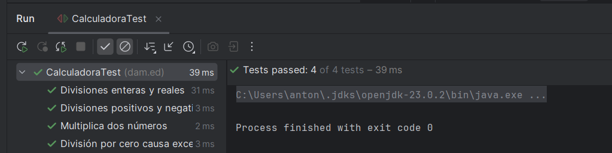
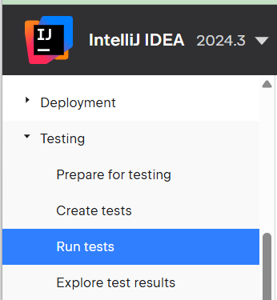

## 4.1 Ejercicio Teoría Ahora tu

Creamos proyecto llamado **"ed"** en una ruta que tengamos para Entornos de Desarrollo de GitHub.



- Subimos a repositorio Github Entornos Desarrollo
- Subimos el repositorio a tarea Moodle




### Codigo:

```java
package dam.ed;

public class Calculadora {

    double suma(double a, double b) {
        return a + b;
    }

    double resta(double minuendo, double sustraendo) {
        return minuendo - sustraendo;
    }

    double multiplica(double a, double b) {
        return Math.abs(a * b);
    }

    double divide(double dividendo, double divisor) throws Exception {
        if (divisor == 0) {
            throw new Exception("El divisor es 0");
        }
        return dividendo / divisor;
    }

    double potencia(double base, double exponente) {
        return Math.pow(base, exponente);
    }
}
```

### Seleccionar Generar Test en el IDE (Alt + ENTER)



### Crear test



### Ejecuta test



### Errores en la ejecución



### Tras la corrección



## Referencias:

- teoría UD5
- [Documentación JetBrains](https://www.jetbrains.com/help/idea/performing-tests.html#run-tests)
- 
