## 4 Framework de testing

Moodle:

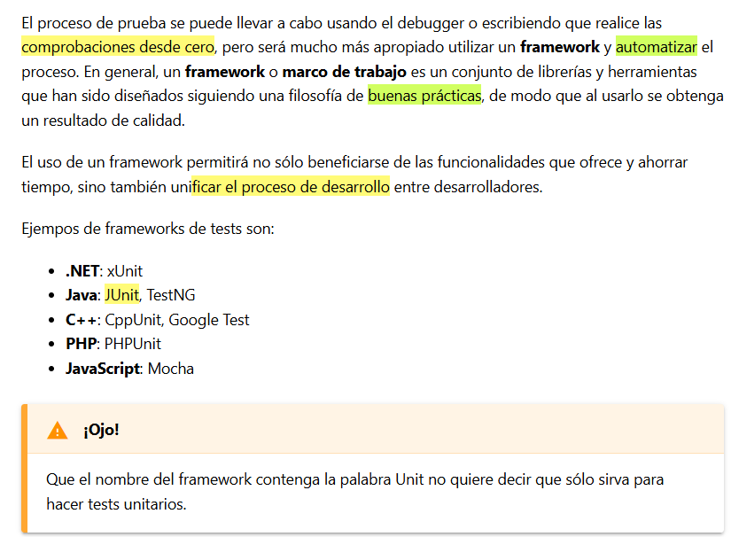

## Framework JUnit en IDE IntelliJ

En este tema, dado que estamos aprendiendo a programar con Java, haremos uso del framework **JUnit** en su  **versión 5** .

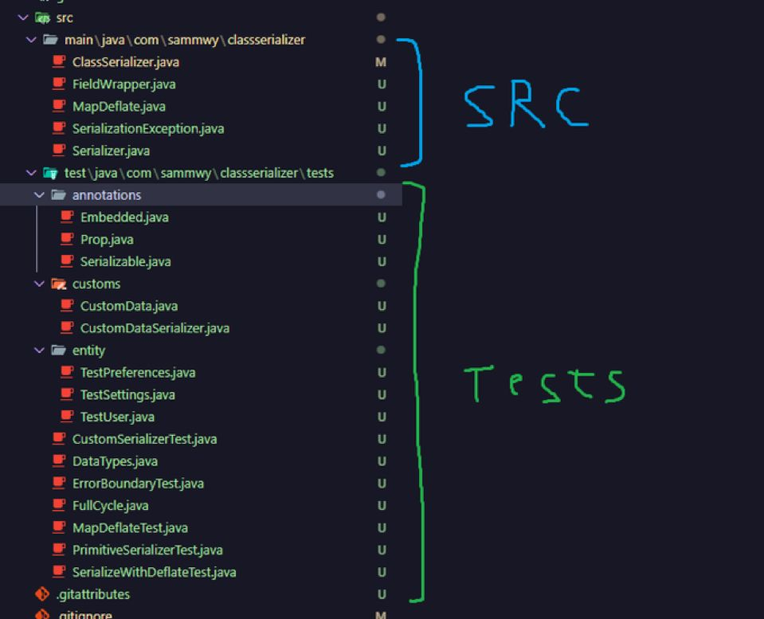

### 4.1. Automatización de pruebas

#### A) Casos de prueba

Los casos de prueba generalmente se componen de **entradas conocidas y salidas esperadas.**

En la siguiente tabla tenemos un ejemplo de casos de prueba para un método que divide un número entre otro:

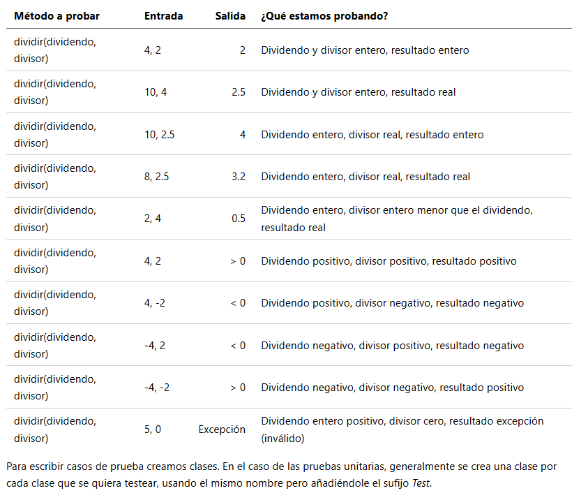

#### B) Anotaciones

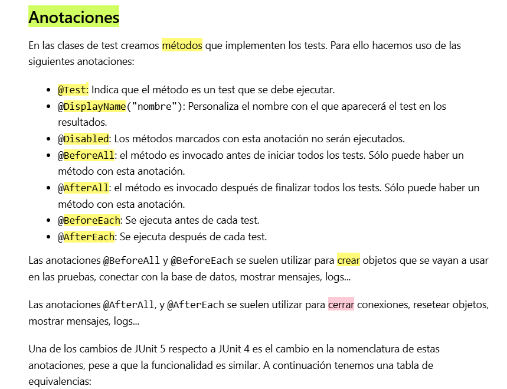

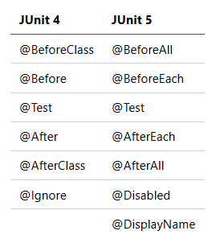

#### C) Aserciones

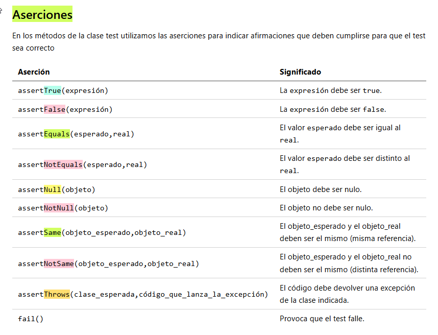

#### D) Generar documentación

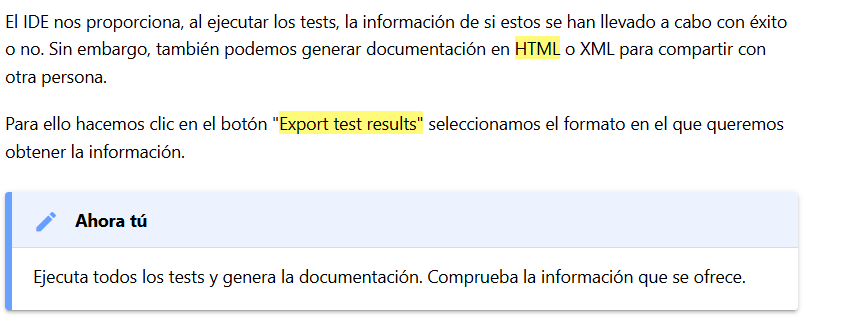

#### E) Cobertura del código

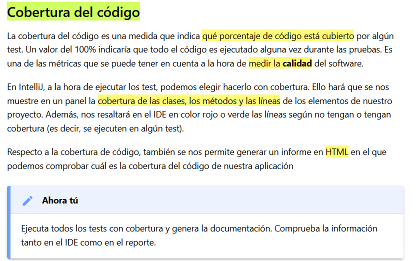

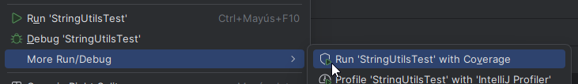

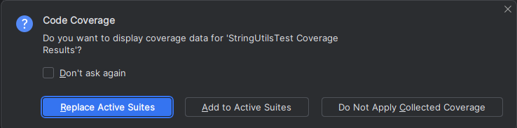

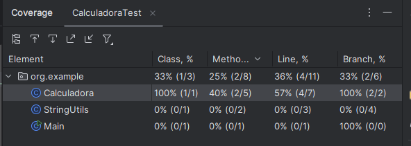

## Creamos un proyecto "Testeando"

Cambiamos la ruta a un proyecto nuevo llamado **Testeando** dentro de la UD5 donde crearemos los diferentes clases de Test.

* Para crear un proyecto dentro de tu repositorio GitHub simplemente le das a crear nuevo proyecto y seleccionas la ruta del repositorio /UD5

El código que necesitas está en Moodle.

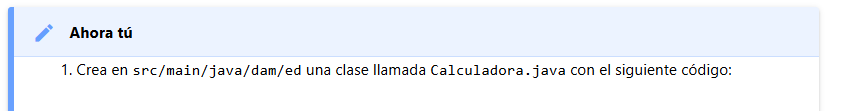

Está documentado en Ejemplos/Calculadora

## 4.2. TDD

### A) ¿Qué es TDD?

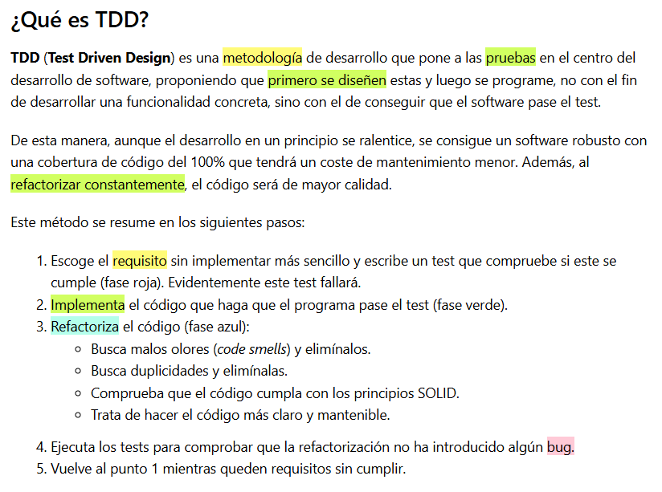

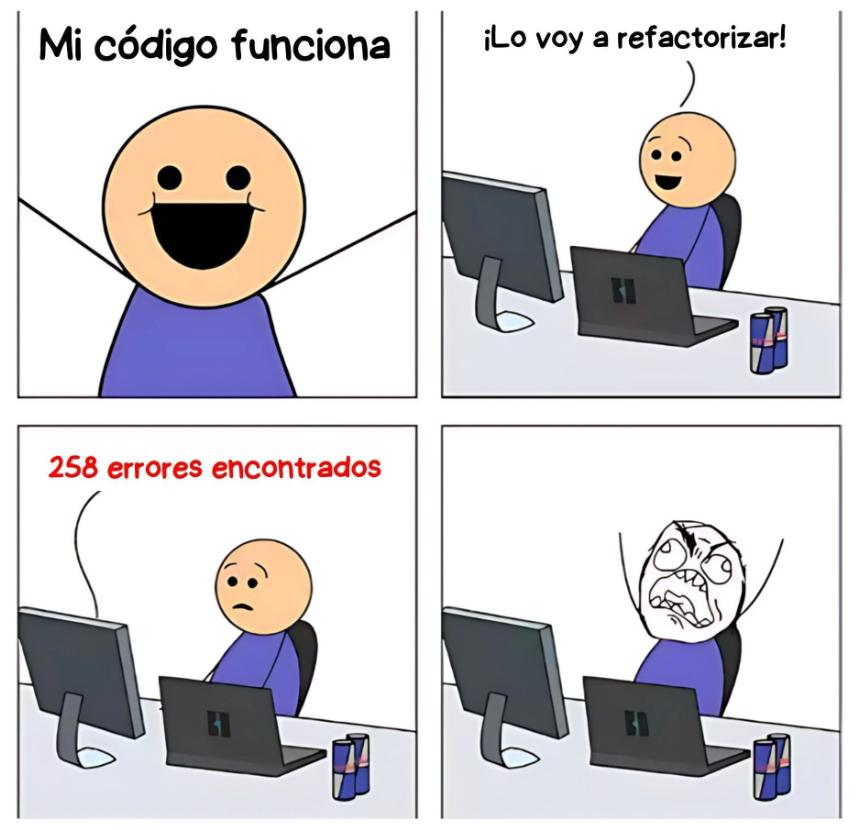

### B) Tests limpios (Clean tests)

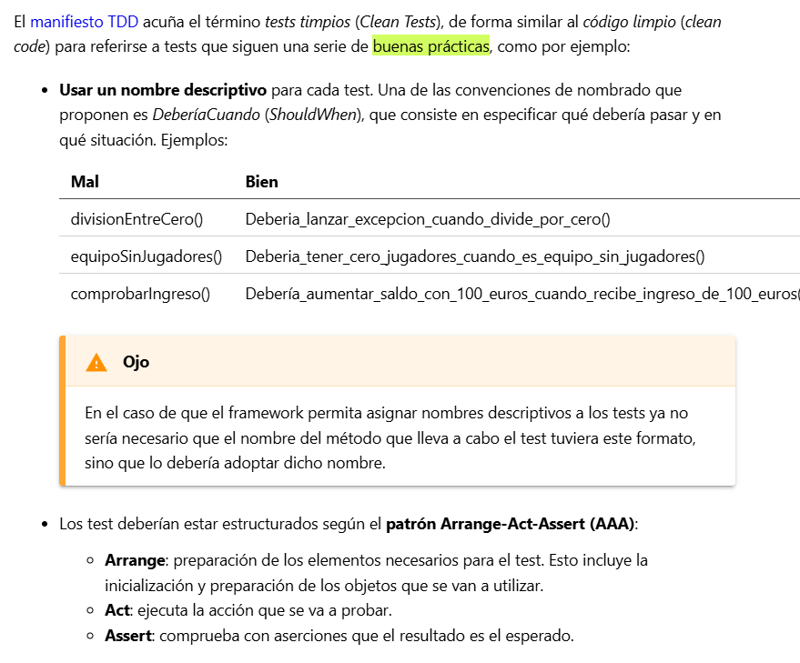

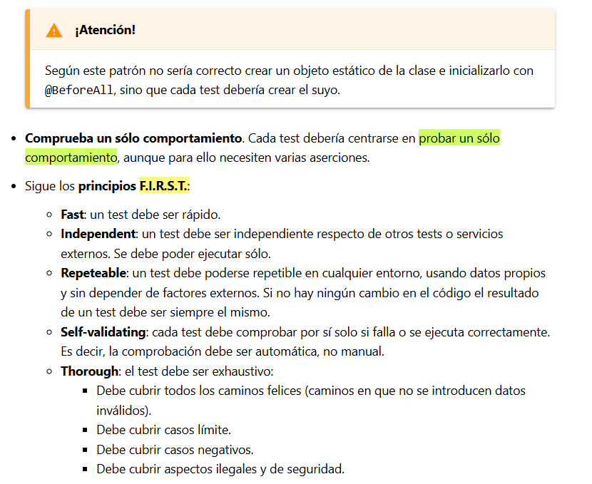

### C) Ejemplo guiado de TDD

En este ejemplo guiado voy a crear una clase llamada Pila. No voy a usar ninguna estructura compleja que ya me proporcione las librerías de JAVA.

##### Ver en Moodle y subirlo al repositorio

## Referencias.

Para más información

* [Dominando los Test JUnit en Java](https://www.youtube.com/watch?v=mEzoe6KSUu8&t=2292s)

<iframe width="895" height="483" src="https://www.youtube.com/embed/mEzoe6KSUu8" title="🔍🛠️ Dominando los Test Unitarios en JAVA | JUnit 🚀💻" frameborder="0" allow="accelerometer; autoplay; clipboard-write; encrypted-media; gyroscope; picture-in-picture; web-share" referrerpolicy="strict-origin-when-cross-origin" allowfullscreen></iframe>
