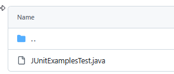

## Probando Diferentes Assertions.

Ejemplos sencillos de cada una de las funciones de prueba JUnit en Java en un testeo de teoría ya que NO aplica sobre ninguna clase.

### **1️⃣ Configuración**

Asegúrate de tener JUnit en tu proyecto (JUnit 5 en este caso). Si usas  **Maven** , agrégalo a tu `pom.xml`:

```xml
<dependencies>
    <dependency>
        <groupId>org.junit.jupiter</groupId>
        <artifactId>junit-jupiter-api</artifactId>
        <version>5.9.2</version>
        <scope>test</scope>
    </dependency>
    <dependency>
        <groupId>org.junit.jupiter</groupId>
        <artifactId>junit-jupiter-engine</artifactId>
        <version>5.9.2</version>
    </dependency>
</dependencies>
```

---

### **2️⃣ Ejemplos de Pruebas JUnit**

```java
import org.junit.jupiter.api.Test;
import static org.junit.jupiter.api.Assertions.*;

class JUnitExamplesTest {

    @Test
    void testAssertTrue() {
        int a = 5;
        int b = 3;
        assertTrue(a > b, "a debería ser mayor que b");
    }

    @Test
    void testAssertFalse() {
        int a = 2;
        int b = 5;
        assertFalse(a > b, "a no debería ser mayor que b");
    }

    @Test
    void testAssertEquals() {
        int resultado = 4 + 2;
        assertEquals(6, resultado, "El resultado debería ser 6");
    }

    @Test
    void testAssertNotEquals() {
        int resultado = 4 + 2;
        assertNotEquals(5, resultado, "El resultado no debería ser 5");
    }

    @Test
    void testAssertNull() {
        String texto = null;
        assertNull(texto, "El texto debería ser nulo");
    }

    @Test
    void testAssertNotNull() {
        String texto = "Hola";
        assertNotNull(texto, "El texto no debería ser nulo");
    }

    @Test
    void testAssertSame() {
        String str1 = "Hola";
        String str2 = str1;  // Apunta al mismo objeto
        assertSame(str1, str2, "Ambos deben referenciar al mismo objeto");
    }

    @Test
    void testAssertNotSame() {
        String str1 = new String("Hola");
        String str2 = new String("Hola");
        assertNotSame(str1, str2, "Ambos objetos deberían ser diferentes en memoria");
    }

    @Test
    void testAssertThrows() {
        assertThrows(ArithmeticException.class, () -> {
            int resultado = 10 / 0;  // Esto lanza una excepción
        }, "Debería lanzar ArithmeticException");
    }

    @Test
    void testFail() {
        fail("Esta prueba siempre fallará intencionalmente");
    }
}
```

---

### **3️⃣ Explicación rápida**

* ✅ `assertTrue` y `assertFalse` verifican si la condición es verdadera o falsa.
* ✅ `assertEquals` y `assertNotEquals` comparan valores esperados y reales.
* ✅ `assertNull` y `assertNotNull` verifican si un objeto es nulo o no.
* ✅ `assertSame` y `assertNotSame` verifican si dos referencias apuntan al mismo objeto.
* ✅ `assertThrows` verifica que una excepción se lanza correctamente.
* ✅ `fail()` **siempre falla** (usado para pruebas no implementadas aún).

Puedes ejecutar estos test en  **IntelliJ IDEA** , **Eclipse** o con el comando:

```bash
mvn test
```

## Capturas:

Creo proyecto


Alt + Insert sobre fichero POM (Dependency)


Buscamos "org.junit.jupiter:junit-jupiter"


### Creamos Proyecto en nuestro Repositorio

* EntornosDesarrollo/UD5/**TiposAssertions**

### Nueva clase en Carpeta TEST

* Clase JUnitExamplesTest


### Pegamos y PERSONALIZAMOS Código

Prueba y **modifica** el código del punto 2 de los diferentes test.

Recuerda que esta **prueba especial** NO aplica sobre ninguna clase


### Ejecutamos


* Como tenemos el **testFail** que siempre falla, podemos desactivarlo:


### Subimos al repositorio UD5/TiposAssertions

Si lo tienes todo bien configurado, deberá aparecer tu proyecto en GitHub, compruebalo!


