# Ejemplo guiado de TDD Documentación.

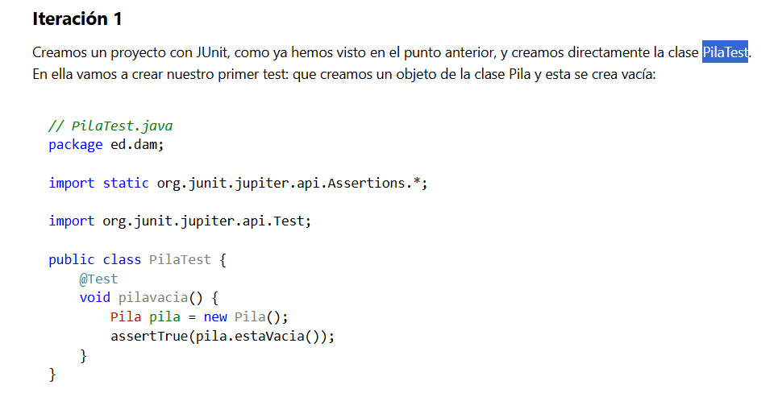

## Nuevo Proyecto TDD Pila

    Dentro del repositorio EntornosDesarrollo/UD5

Dependencias
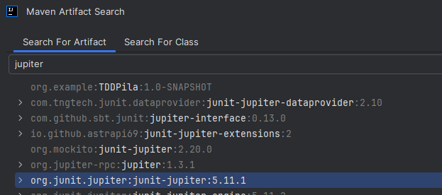

### Primero el Test

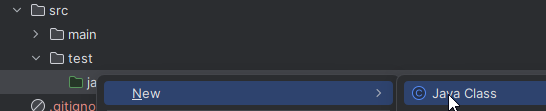

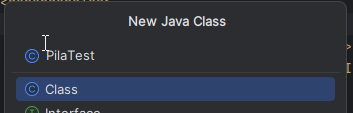

Si ejecutamos, fallará como es normal:

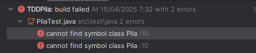

### Despúes creamos la clase Pila

Ello nos obliga a crear la clase Pila y a crearle un método `estaVacia()`.

Como nuestro fin es que pase los Test, con que este método devuelva `true` nos sirve:

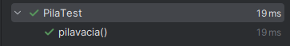

## Iteración 2

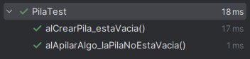

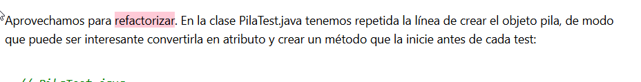

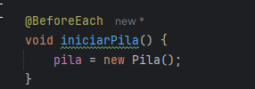

## Iteración 3

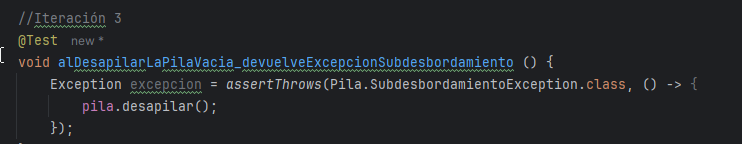

## Iteración 4

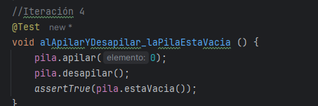

## Iteración 5

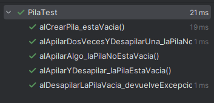

## Iteración 6

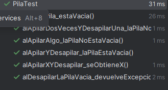

## Iteración 7

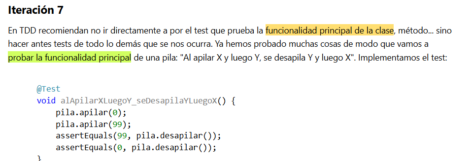

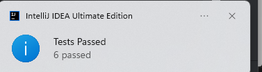

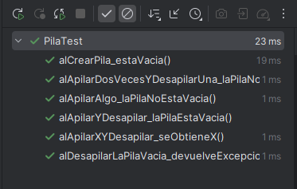

## Súbelo al repositorio
