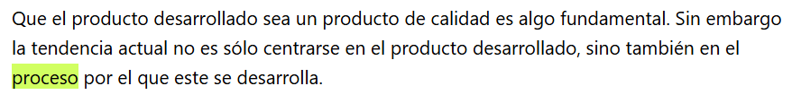
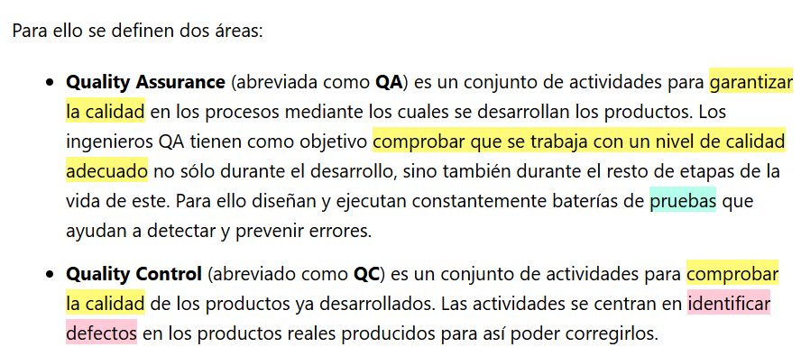
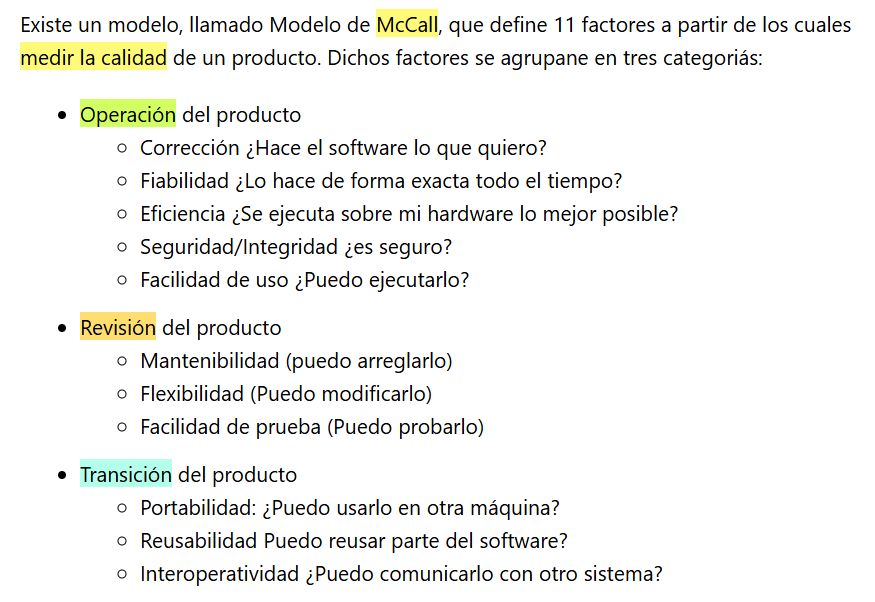

## 6 Calidad

### 6.1. QA y QC

### 6.2. Factores de calidad

## Enlace Integración

[Enlace a ChatGPT con las instrucciones para la integración con Maven](https://chatgpt.com/share/67fe6af0-87c8-8003-9d79-45e98a031d0f)

<iframe width="1236" height="695" src="https://www.youtube.com/embed/lUDbBG5G7tE" title="Github Actions: Automatiza la ejecución de test unitarios para tu repositorio." frameborder="0" allow="accelerometer; autoplay; clipboard-write; encrypted-media; gyroscope; picture-in-picture; web-share" referrerpolicy="strict-origin-when-cross-origin" allowfullscreen></iframe>
