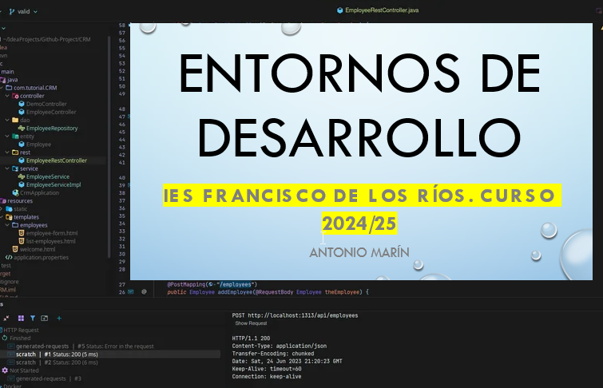

# Módulo Entornos Desarrollo

Materiales de código, a partir de la **UD5 Testing** para el Módulo Desarrollo de Aplicaciones Web Entorno Servidor.

* 1º DAM. IES Francisco de los Ríos.
* Curso 2024/25
* [Enlace a la web Google Sites (Diapositivas)](https://sites.google.com/iesfranciscodelosrios.es/dam1-entornos-desarrollo/inicio)
* [Enlace a Moodle del Curso](https://educacionadistancia.juntadeandalucia.es/centros/cordoba/course/view.php?id=2861&section=0#tabs-tree-start)

